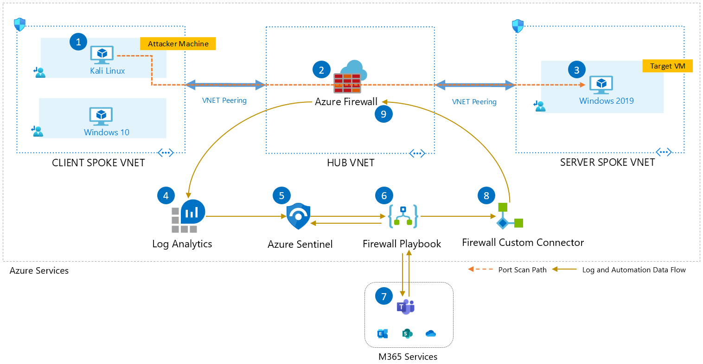
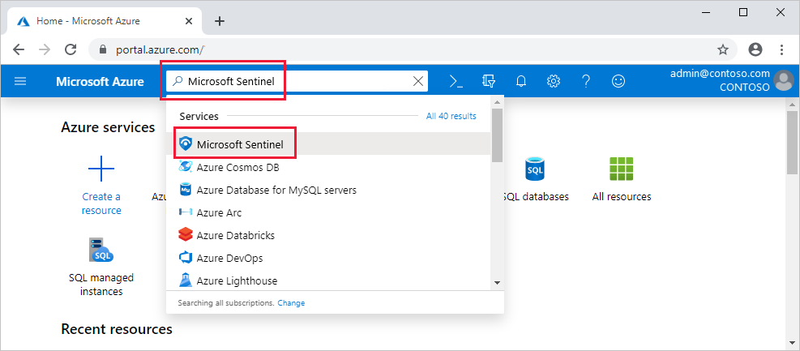

# Scenario



In case of an attack from an external adversary or malicious activity in a trusted network, the traffic representing the anomaly must inevitably flow through the network where it will be processed and logged by network devices such as Azure Firewall. While real time threat detection and prevention features such as IDPS, can enable you to take actions for the traffic patterns in question ahead of time, there will be scenarios which require a fine gained evaluation before making decisions to block traffic. This is where Azure Firewall detections and hunting queries in Azure Sentinel provide you with a method to detect threats and respond to them automatically.

For more insights, please read the following [blog post](https://techcommunity.microsoft.com/t5/azure-network-security-blog/new-detections-hunting-queries-and-response-automation-in-azure/ba-p/2688746) writen by Mohit Kumar.

# Prerequisites

This is the starting point for the instructions on deploying the [Port-Scanning-Lab](../README.md). There is required access and tooling you'll need in order to accomplish this. Follow the instructions below so that you can get your environment ready to proceed with the Port Scanning Lab creation.

## Steps

1. Latest [Azure CLI installed](https://learn.microsoft.com/cli/azure/install-azure-cli?view=azure-cli-latest) (must be at least 2.37), or you can perform this from Azure Cloud Shell by clicking below.
1. An Azure subscription.

   The subscription used in this deployment cannot be a [free account](https://azure.microsoft.com/free); it must be a standard EA, pay-as-you-go, or Visual Studio benefit subscription. This is because the resources deployed here are beyond the quotas of free subscriptions.

   > :warning: The user or service principal initiating the deployment process _must_ have the following minimal set of Azure Role-Based Access Control (RBAC) roles:
   >
   > * [Contributor role](https://learn.microsoft.com/azure/role-based-access-control/built-in-roles#contributor) is _required_ at the subscription level to have the ability to create resource groups and perform deployments.
   > * [User Access Administrator role](https://learn.microsoft.com/azure/role-based-access-control/built-in-roles#user-access-administrator) is _required_ at the subscription level since you'll be performing role assignments to managed identities across various resource groups.

# Use the Azure CLI to create a storage account to store the Terraform state files.
This storage account will be used to store the state of the deployment.

Create some variables to start with

```bash
REGION=<REGION>
STORAGEACCOUNTNAME=<UNIQUENAME>
CONTAINERNAME=mssentinel
TFSTATE_RG=rg-tfstate-lab
```


Create a Resource Group:
```bash
az group create --name $TFSTATE_RG --location $REGION
```

Create a Storage Account:
```bash
az storage account create -n $STORAGEACCOUNTNAME -g $TFSTATE_RG -l $REGION --sku Standard_LRS
```

Create a Storage Container within the Storage Account:

```bash
az storage container-rm create --storage-account $STORAGEACCOUNTNAME --name $CONTAINERNAME
```

### Next step

## Update variables files and deploy Azure resources by Terraform 

First you need to rename the file "tarraform.tfvars.example" in "terraform.tfvars".

In the "terraform.tfvars" & "variables.tf" file, update the defaults to reflect the display names as needed to either match existing groups or create names that fit your requirements.  

Once the files are updated, deploy using Terraform Init, Plan and Apply.

NOTE: Remember that should be logged into Azure by azure cli

```bash
terraform init -backend-config="resource_group_name=$TFSTATE_RG" -backend-config="storage_account_name=$STORAGEACCOUNTNAME" -backend-config="container_name=$CONTAINERNAME"
```

```
terraform plan
```

```
terraform apply
```

If you get an error about changes to the configuration, go with the `-reconfigure` flag option.

# Enable Microsoft Sentinel

1. Sign in to the Azure portal. Make sure that the subscription in which Microsoft Sentinel is created is selected.

2. Search for and select **Microsoft Sentinel.**



3. Select **Create**.

4. Select the workspace you want to use, in our case is **log-hub-lab** under resource group **rg-hub-lab**.

5. Select **Add**

# Set up data connectors

Microsoft Sentinel ingests data from services and apps by connecting to the service and forwarding the events and logs to Microsoft Sentinel.

1. From the main menu, select **Data connectors**. This opens the data connectors gallery.

2. Select a data connector, and then select the **Open connector page** button.

3. The connector page shows instructions for configuring the connector, and any other instructions that may be necessary. Make sure the status of **Azure Firewall** is **Connected**.

After you set up your data connectors, your data starts streaming into Microsoft Sentinel and is ready for you to start working with. You can view the logs in the built-in workbooks and start building queries in Log Analytics to investigate the data.